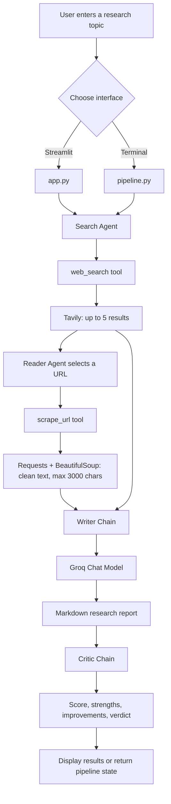

# ResearchMind

ResearchMind is a Streamlit application that uses LangChain, Groq, and Tavily to research a topic and produce a structured report. Four specialized stages work together:

1. **Search Agent** finds recent web results.
2. **Reader Agent** chooses a relevant result and scrapes deeper content.
3. **Writer Chain** turns the gathered material into a research report.
4. **Critic Chain** reviews the report, gives it a score, and suggests improvements.

The project also includes a terminal pipeline for running the same workflow without the Streamlit interface.

## Features

- Recent web search through Tavily.
- LLM-powered selection of a source to read in depth.
- HTML cleanup with BeautifulSoup before content is passed to the writer.
- Markdown research reports with introduction, findings, conclusion, and sources.
- Separate critic output with a score, strengths, and improvement areas.
- Streamlit UI with progress indicators, raw search/scraped output, and report download.

## Application Flow



### Detailed execution sequence

1. `app.py` loads the Streamlit page and imports the agents and tools.
2. The user enters a topic and selects **Run Research Pipeline**.
3. The Search Agent calls `web_search`, which requests up to five Tavily results and returns each title, URL, and a shortened snippet.
4. The Reader Agent receives the search output, selects a URL, and calls `scrape_url`.
5. `scrape_url` downloads the page, removes `script`, `style`, `nav`, and `footer` elements, then returns up to 3,000 characters of cleaned text.
6. The Writer Chain combines the search results and scraped content and asks the Groq model to write the report.
7. The Critic Chain evaluates the completed report and returns the requested review format.
8. Streamlit displays raw intermediate results, the final report, critic feedback, and a Markdown download button.

## Project Structure

| File | Responsibility |
| --- | --- |
| `app.py` | Streamlit user interface, session state, progress display, and result rendering. |
| `pipeline.py` | Sequential command-line pipeline and reusable `run_research_pipeline()` function. |
| `agents.py` | Groq model setup, search/reader agent builders, writer chain, and critic chain. |
| `tools.py` | Tavily search tool and HTTP/BeautifulSoup scraping tool. |
| `config.py` | Loads environment variables or Streamlit secrets and validates required keys. |
| `requirements.txt` | Python dependencies. |
| `.gitignore` | Excludes virtual environments, secrets, caches, and local editor files. |

## Requirements

- Python 3.11 or newer.
- A [Groq API key](https://console.groq.com/keys).
- A [Tavily API key](https://app.tavily.com/home).
- Internet access for model, search, and source requests.

## Installation

From the project directory, create and activate a virtual environment:

### Windows PowerShell

```powershell
python -m venv .venv
Set-ExecutionPolicy -Scope Process -ExecutionPolicy RemoteSigned
.\.venv\Scripts\Activate.ps1
python -m pip install --upgrade pip
pip install -r requirements.txt
```

### macOS or Linux

```bash
python3 -m venv .venv
source .venv/bin/activate
python -m pip install --upgrade pip
pip install -r requirements.txt
```

## Configure API Keys

Create a `.env` file in the project root:

```dotenv
GROQ_API_KEY=your_groq_api_key
TAVILY_API_KEY=your_tavily_api_key
```

Do not commit this file. It is ignored by `.gitignore`.

For Streamlit Cloud, add the same values to the app's secrets configuration:

```toml
GROQ_API_KEY = "your_groq_api_key"
TAVILY_API_KEY = "your_tavily_api_key"
```

`config.py` checks environment variables first and then falls back to `st.secrets`. Missing values raise a clear configuration error when the application starts.

## Run the Application

Start the Streamlit interface:

```powershell
streamlit run app.py
```

Open the local URL printed by Streamlit, usually `http://localhost:8501`, enter a topic, and run the pipeline. The report can be downloaded as a `.md` file from the results section.

## Run from the Terminal

Run the interactive command-line version:

```powershell
python pipeline.py
```

Enter a topic when prompted. The function returns a dictionary with these keys:

```text
search_results
scraped_content
report
feedback
```

The pipeline also can be imported by another Python module:

```python
from pipeline import run_research_pipeline

state = run_research_pipeline("Recent advances in fusion energy")
print(state["report"])
print(state["feedback"])
```

## Model and Data Behavior

- The configured Groq model is `openai/gpt-oss-20b` with temperature `0`.
- Tavily is limited to five search results per query.
- Search snippets are shortened before they are displayed by the search tool.
- The reader receives only the first 800 characters of the search-agent response when choosing a URL.
- Scraped pages are reduced to 3,000 characters after common navigation and code elements are removed.
- The writer is instructed to include all URLs found in the supplied research text, but generated reports should still be fact-checked before publication.
- Some websites may block automated requests, require JavaScript, or return incomplete content. In that case the reader tool returns an error message for the model to handle.

## Troubleshooting

### Dependency or import errors

Confirm the virtual environment is active, then reinstall dependencies:

```powershell
pip install -r requirements.txt
```

### Port already in use

Run Streamlit on another port:

```powershell
streamlit run app.py --server.port 8501
```

## Development Notes

There is currently no automated test suite in the repository. Before deploying changes, verify both entry points manually:

```powershell
python pipeline.py
streamlit run app.py
```

Keep API keys out of source control and review generated reports against the original sources before relying on them for decisions or publication.